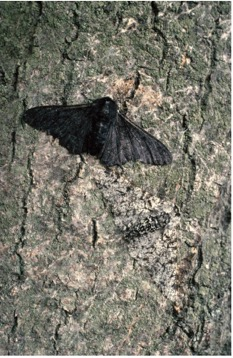
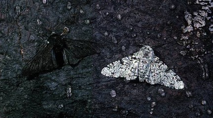

```{r}
#| label: setup
#| include: false
#| eval: true

library(tidyverse)
library(Sleuth3)

spp <- read.csv(here::here("data/plant_spp_nitrogen.csv"),
                  stringsAsFactors = TRUE)

```

# Learning Objectives

# Setup

## Libraries

```{r}
#| eval: false
#| echo: true

library(tidyverse)
library(Sleuth3)
```

## Data

-   Download the "plant_spp_nitrogen.csv" from D2L

-   Place it in your `data/` folder

-   Load the data into your Quarto document by placing the following in the "setup" code block at the top of your document with the following:

```{r}
#| eval: false
#| echo: true

spp <- read.csv(here::here("data/plant_spp_nitrogen.csv"),
                  stringsAsFactors = TRUE)

```

# Problems

-   Your final assignment will be a rendered html document
-   As such, you will be writing code and answering questions a little bit differently
-   For each question, put the question number in your document as a second-level heading
-   Then place your answer below that
-   for example:

```         
## 1.1 

code chunk or answer  

## 1.2  

code chunk or answer  

## 1.3 

code chunk or answer  etc.
```

-   In general, when a question asks you to do anything with the data (modify, calculate, plot, fit a model), you will insert a new code chunk to perform that calculation

-   When a question asks you to interpret your results or answer something in plain words, you will just write out your answer below that problem heading.

## Problem 1: `plant_spp_nitrogen.csv`

We will be analyzing a simulated data set looking at the change in species across a gradient of increasing Nitrogen deposition. This data is based on the results of [Stevens et al. 2004](https://www.science.org/doi/10.1126/science.1094678)

1.1 Print out the first few rows of the data using `as_tibble()`.

```{r}
as_tibble(spp)
```

1.2 What are the names and the type of each column in this data set.

```{r}
#N_dep is a double (continuous)
# spp is an integer (discrete number)
```

1.3 Make a plot of the data with Nitrogen deposition level on the x-axis, and the count of species on the y-axis.

```{r}
ggplot(spp, 
       aes(x = N_dep, 
           y = spp)) +
  geom_point()
```

1.4 Modify your plot to include both a linear regression (in blue), and a Poisson regression (in pink). Also, extend your axes to show where both lines would cross 0 on the y-axis. **NOTE** please make sure that your code chunk does not print out any warnings or messages

```{r}
#| warning: false
#| message: false
ggplot(spp,
       aes(x = N_dep, 
           y = spp)) +
  geom_point() +
  stat_smooth(method = "lm",
              color = "dodgerblue",
              fullrange = TRUE) +
  stat_smooth(method = "glm",
              method.args = list("poisson"),
              fullrange = TRUE,
              color = "pink") +
  scale_x_continuous(limits = c(0, 50)) +
  scale_y_continuous(limits = c(-5, 31)) +
  theme_bw() 
```

1.5 Fit a Poisson regression with a log link using the `glm()` function. `spp` is your response variable, and `N_dep` is your predictor variable. Print the summary of your model here as well.

```{r}
spp_glm <- glm(spp ~ N_dep,
               data = spp,
               family = poisson(link = "log"))
summary(spp_glm)
```

1.6 What is the ratio of your residual deviance compared with your residual degrees of freedom? Add a code chunk which calculates this ratio, as well as interprets whether or not a Poisson regression is reasonable for this data and explain why or why not.

```{r}
56/53
# A good ratio is 1, and anything less than 2 is ok
# this ratio is 1.05, indicating that the poisson is a good model
```

1.7 Write out the estimated value for both your intercept and your $\beta_1$ coefficient on **both** the *link* and the *original* scale.

```{r}
# intercept = 3.65 on the link scale and 
exp(3.657116) # on the original scale
# beta_1 = -0.05 on the link and 
exp(-0.054429) # on the original scale

```

1.8 The $\beta_1$ estimate from the model is on the link-scale. When you back-transform this to the original scale, how can you interpret this number? Or in other words, as `N_dep` increases by 1 unit, what happens to `spp`?

```{r}
exp(coef(spp_glm)[2])
# this means that for every 1 unit increase in N deposition, the number of species is only ~94.7% of the previous value, or a decline of 5.3%
```

1.9 Estimate the number of species (on the "real" scale and rounded to the nearest whole number) when `N_dep` = 10, 20, 30 and 40

```{r}
round(exp(coef(spp_glm)[1] + coef(spp_glm)[2]*c(10, 20, 30, 40)))
```

1.10 Make a plot of the original data with a Poisson regression. This is similar to 1.4 above, but you will not include the linear regression line nor will you extend the axes.

```{r}
ggplot(spp,
       aes(x = N_dep, 
           y = spp)) +
  geom_point(color = "dodgerblue",
             size = 3) +
  stat_smooth(method = "glm",
              method.args = list("poisson"),
              color = "black",
              fill = "pink") +
  theme_minimal()
```

## Problem 2: `case2102` ; Peppered-moth

The peppered moth (*Biston betularia*) is a classic example of biological evolution in response to anthropogenic impacts. A detailed description is available [here](https://branchcollective.org/?ps_articles=nathan-k-hensley-and-john-patrick-james-soot-moth-biston-betularia-and-the-victorian-end-of-nature) (and is also where I got the below images from). Briefly, as the industrial revolution ramped up in England, soot from coal smoke made white barked trees appear black. The peppered moth before this time was white and camouflaged with the tree bark. As the trees became black, a dark "morph" of the peppered moth appeared and became more abundant, presumably because it was better able to hide from predators.

[{width="345"}](https://branchcollective.org/?ps_articles=nathan-k-hensley-and-john-patrick-james-soot-moth-biston-betularia-and-the-victorian-end-of-nature)

[{width="726"}](https://branchcollective.org/?ps_articles=nathan-k-hensley-and-john-patrick-james-soot-moth-biston-betularia-and-the-victorian-end-of-nature)

We will be analyzing data collected outside of Liverpool in Northern Wales. Light and dark morphs were glued to trees in life-like positions and then recollected 24 hours later. Missing individuals were assumed to be taken by predators.

We will test the hypothesis that survival depends on the distance from the city (i.e., dark tree bark at low distance, and lighter bark further away) as well as the morph of the individual. This is essentially an ANCOVA design, but the linear model will be switched to a generalized linear model with a binomial response.

### Data loading and wrangling

-   Load the `case2102` data and save it as `moth`

```{r}
#| eval: true
#| echo: true

moth <- data("case2102") |>
  as_tibble()
moth
```

-   `Morph` indicates if the individual was light or dark

-   `Distance` is the distance of the plot from Liverpool (km)

-   `Placed` is the total number of individuals that were put out into the field

-   `Removed` is the number that were still on the trees 24 hours later (i.e., this is the number that "survived"). This is what we are classifying as **successes**

### Modify the data

-   Run the following code to:

    -   Make an object called `moth`

    -   Calculate the proportion that survived

        -   i.e., `Removed / Placed`

    -   Set the levels of the `Morph` variable so that "light" is the reference

        -   i.e., make a new `Morph` column, by calling the `factor()` function on the original `Morph` column.

        -   Inside the `factor()` function, you can use the `levels` argument to manually designate light and dark.

```{r}
moth <- moth |>
  mutate(prop = Removed / Placed,
         Morph = factor(Morph, levels = c("light", "dark"))) 

```

2.1 Plot the `moth` data with `prop` on the y-axis, `Distance` on the x-axis, and map `Morph` to color. Add a line of best fit based on a binomial glm with `Placed` as the weight in your `stat_smooth()` function

-   I recommend playing with the color palette to emphasize the "light" and "dark" morphs

```{r}
ggplot(moth, 
       aes(x = Distance, 
           y = prop,
           color = Morph)) +
  geom_point(size = 3) +
  geom_smooth(method = "glm",
              method.args = list(binomial),
              aes(weight = Placed)) +
  theme_bw() +
  scale_color_viridis_d(option = "magma",
                        direction = -1,
                        end = 0.75)
```

2.2 Fit a binomial glm model to the data. The `prop` is going to be your response variable, and `Placed` will be your weight.

-   Note that we are testing two main effects as well as the interaction between `Distance` and `Morph`. In the lecture, we only had one continuous predictor

```{r}
moth_glm <- glm(prop ~ Distance*Morph,
                data = moth, 
                family = binomial(link = "logit"),
                weight = Placed)

```

2.3 Print out the summary of your glm model.

```{r}
summary(moth_glm)
```

2.4 What is the reference group in this model?

```{r}
# The light Morph
```

2.5 What scale are the coefficients displayed on?

```{r}
# These are presented on the logit or log odds scale. 
```

2.6 Write out the full equation for both generalized linear equations. One equation will be for the light morph, and one for the dark morph

```{r}
# Light
# Logit(survival) = 0.717729 + 0.009287 * Distance

# Dark
# Logit(survival) = (0.717729 + 0.411257) + (0.009287-0.027789) * Distance
```

2.7 Interpret the statistical results for the two Intercepts. Specifically, look at the p-values and tell me if the two Morphs have different intercepts, or if they are the same.

```{r}
# The `Morphdark` coefficient is the estimated differences in intercepts. It has a p-value > 0.05, so the intercepts are not statistically different
```

2.8 Interpret the statistical result of the $\beta_1$ coefficient for the light morph. Is this statistically significant? What does this mean in plain language.

```{r}
# The `Distance` Coefficient is the beta1 for the light morph. It has a p-value > 0.05 which means it is not significant. 
# In plain words, this means that the chances for survival of light morphs does not depend on the distance from the city
```

2.9 Interpret the statistical result of the $\beta_1$ coefficient for the dark morph. Is this statistically significant? What does this mean in plain language.

```{r}
# The difference in beta1 between the light and dark morph is significant. 

# it is also negative, meaning that the further from the city you get, there is a lower chance of survival for dark morphs. 
```

2.10 As distance from the city increases by 1 unit for the dark morph, what are the *odds* that an individual will survive?

-   **Hint** Think about the scale that the coefficients are on, and how to transform that to the Odds ratio

```{r}
exp(0.009287-0.027789)
```

2.11 Predict the survival on the **link** scale for a dark morph which is found at 10, 20, and 30 km from Liverpool.

```{r}
predict(moth_glm,
        newdata = list(Distance = c(10, 20, 30), 
                       Morph = c("dark", "dark", "dark")),
        type = "link")
```

2.12 Do the same prediction as in 2.11, but this time make the distances 0, 25, and 50 km and change to the **response** scale.

```{r}
predict(moth_glm,
        newdata = list(Distance = c(0, 25, 50), 
                       Morph = c("dark", "dark", "dark")),
        type = "response")
```

2.13 Interpret the response-scale predictions in 2.12. In your own words, explain how likely it is for a dark morph individual to survive at the three distances.

```{r}
# A dark morph has a 24% chance of being eaten at 0 distance. This increases to 45% chance at 50 km. 
# Presumably, the trees are lighter further away, so the dark morphs stand out more. 
```
