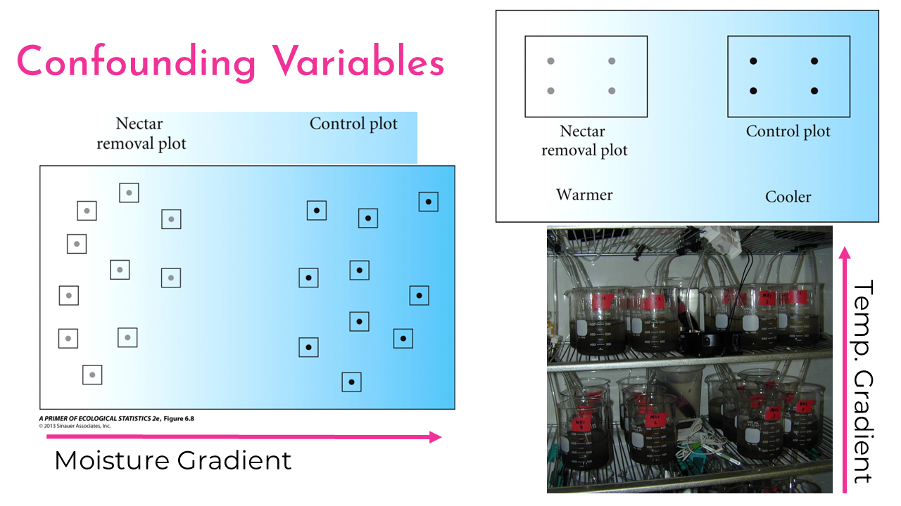
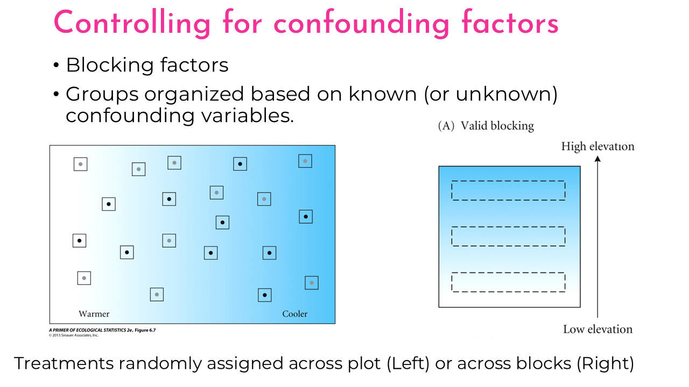

```{r}
#| label: setup
#| include: false

# libraries
library(tidyverse)

# data objects
data("PlantGrowth")
crop <- read.csv(here::here("data/crop_anova.csv"),
                 stringsAsFactors = TRUE)
data("ToothGrowth")
```

# Overview  

Analysis of variance (ANOVA) is a technique for assessing differences across 3+ groups. There are three types that we will go over:  

-   One-way ANOVA  

    -   Think of this as a t-test with 3 or more groups

-   Factorial ANOVA  

    -   This is a way of testing the signifigance of multiple factors or categorical predictors

-   Two-way ANOVA with interaction

    - This is a modification of the factorial ANOVA which tests to see if the predictor values interact with one another. 


# Setup

### Libraries

```{r}
#| eval: false
library(tidyverse)
```

### Data  

-   Load multiple data objects for this lecture  

-   `PlantGrowth` is already in R  


```{r}
#| eval: false
data("PlantGrowth")
crop <- read.csv("data/crop_anova.csv",
                 stringsAsFactors = TRUE)
data("ToothGrowth")
```

# Lecture Outline

## One-way ANOVA  

-   First we will take a look at the `PlantGrowth` data

```{r}
names(PlantGrowth)
as_tibble(PlantGrowth)
```

-   Data has 30 observations (rows)
-   two variables (columns).
-   `weight` is the dry weight of plants
-   `group` indicates which of three experimental treatments the individual plants were assigned.
-   The three treatments are:

```{r}
distinct(PlantGrowth, group)
```

### Plot `PlantGrowth` data

-   Plot all of the data, without considering the groups.

```{r}
ggplot(PlantGrowth,
       aes(x = 0,
           y = weight)) +
  geom_boxplot()+
  geom_point(
    position = position_jitter(width = 0.1)) 
```

-   Add the grouping variable to see how data is distributed within and across treatments.

```{r}
ggplot(PlantGrowth,
       aes(x = group,
           y = weight,
           color = group)) +
  geom_boxplot()+
  geom_point(
    position = position_jitter(width = 0.1)) 
```

### Check pre-analysis assumptions

#### Assumption: equal variance

Boxplot: - Approximately equal variation across the treatment groups. - There are a couple of "high" data points in `trt1`, but ANOVA is fairly robust to these assumptions, and this looks ok for further analysis.

#### Assumptions: Normality of residuals

Q-Q plot

```{r}
ggplot(PlantGrowth,
       aes(sample = weight)) +
  stat_qq()+
  stat_qq_line()
```

-   The observations (points) fall nearly directly on the reference line

-   We pass this assumption and can continue with an Analysis of Variance (ANOVA).

## Hypotheses with One-way ANOVA

-   An ANOVA analysis tests whether or not there is a difference in at least two of the group means in our data.
-   It is easy to write out the Null hypothesis as:

$$H0: \mu_1 = \mu_2 = \mu_3  ... = \mu_i$$

-   Or, by saying that "all means are equal".

-   Our alternative hypothesis is that "at least one mean is different".

-   Because this inequality could happen between any pairwise combinations, it is no simple task to write these out mathematically, so instead we generally say:

$$HA: \text{"At least one mean is different"}$$

### ANOVA with `lm()`

#### Assumption: Equal variance of residuals

-   Let's first fit a linear model to the data, and check our post-model fit assumption with a fitted vs. residuals plot.

```{r}
plant_lm <- lm(weight ~ group, data = PlantGrowth)
ggplot(plant_lm,
       aes(x = .fitted, y = .resid)) +
    geom_point(
      position = position_jitter(
        width = 0.1,
        height = 0)) +
    geom_hline(yintercept = 0)
```

-   In this plot, the absolute magnitude of the maximum and minimum y-values are approximately the same (-1, 1), and there is no clear pattern

### ANOVA table

-   use the `anova()` function on the model fit object to print the ANOVA table

```{r}
anova(plant_lm)
```

-   This table gives us the:

    -   two degrees of freedom for the model (2, and 27),
    -   the sum of squares,
    -   the mean of squares,
    -   the F-value and the p-value for the `group` factor

-   The degrees of freedom for the group factor is equal to the number of groups - 1.

    -   Here we have 3 groups - 1 = 2 degrees of freedom.

-   The degrees of freedom for the residuals is the total number of observations (30) minus 1 for each group (30 - 3 = 27).

-   The F-value is similar to the t-value from the t-test analyses we ran,

-   It is a measure of the ratio of the signal (differences in group means) to the noise (variation in groups).\

-   If there was no treatment effect (i.e., no "signal") the ratio would be \~1.

-   Larger F-value indicate more signal to noise, and are interpreted as there being a treatment effect.

-   The p-value is an indication of the likelihood of observing the data (i.e., F-value, signal / noise ratio) we have *if* the null hypothesis was true.

-   In this case, a p-value of 0.016 is less than $\alpha = 0.05$, and we can conclude that there is a significant difference between at least two of the means.

### ANOVA Interpretation

-   Remember that the hypotheses for ANOVA are either that all means are the same, or that at least one was different.

-   ANOVA can only tell us that there is a difference.

-   Therefore, our interpretation would look something like this:

> Based on the data, we can conlude that at least one of the means in the fertilizer groups are significantly different (one-way ANOVA: $F_{2, 27}= 4.85$, $p = 0.016$)

-   In order to see *which* means are different, we can view the summary output from the `lm()` model.

### Linear Model Summary

```{r}
summary(plant_lm)
```

-   Here, we can see that we have three coefficients: `(Intercept)`, `grouptrt1`, and `grouptrt2`.

-   Each of these coefficient estimates has an associated Null and Alternative hypothesis.

## `lm()` Coefficient hypotheses

### Intercept, $\beta_0$

$$ H0: \beta_0 = 0 $$ $$ HA: \beta_0 \ne 0 $$

-   As mentioned previously, we are rarely interested in this hypothesis.

-   The `(Intercept)` coefficient is the mean weight estimate for the `ctrl` group, and is equal to `r as.numeric(coef(plant_lm)[1])`.

-   The p-value associated with this simply means that the data support the conclusion that the mean weight of the control plants are not 0.

### Other coefficients, $\beta_{trt1}$, and $\beta_{trt2}$

-   The other two coefficients represent the estimated difference between the `ctrl` group and the respective `trt` groups.

The null hypothesis for each of these coefficients is:

$$H0: \beta_i = 0$$

and the Alternative is:

$$HA: \beta_i \ne 0$$

-   The p-values for both of the other coefficients is $> \alpha = 0.05$, so we fail to reject these hypotheses.
-   In other words, the data do not support a significant difference in plant weights for either treatment when compared with the control group.

### Mean estimates for treatment groups

-   We can combine the coefficient estimates to calculate the mean plant weight for the two treatment groups:

```{r echo=TRUE}
# print out all the coefficient estimates
coef(plant_lm)

# mean estimate for trt1, manual
5.032 - 0.371
# or by using the coefficient estimates:
as.numeric(coef(plant_lm)[1] + coef(plant_lm)[2])

# mean estimate for trt2, manual
5.032 + 0.494

# or by using the coefficient estimates:
as.numeric(coef(plant_lm)[1] + coef(plant_lm)[3])
```

-   We can also look at the confidence intervals for the three coefficients using the `confint()` function:

```{r}
confint(plant_lm)
```

-   Notice that both confidence intervals for the difference cross zero (lower bound is negative, upper bound is positive).
-   This is a good indication that there is not a significant difference between the control group and either treatment.

### `lm()` Interpretation

> The plants from the control group had an average dry weight of 5.032 (95% CI: 4.63, 5.44) grams, and the difference in dry weights for treatment 1 was -0.37 (-0.94, 0.20) while the difference in dry weights for treatment 2 was 0.49 (-0.08, 1.07)

-   You may have noticed that results from the ANOVA table above indicated that there was at least one significant difference between means,

-   but the p-values of 95% CIs from the linear model indicate no significant difference, so what happened?

-   The linear model is only testing whether the two treatment groups are different from the control group.

-   One combination that we are missing is whether or not the two treatments are different from each other.

-   We could go through the process of re-levelling the data so that we set one of the treatment groups is our reference condition.

-   However, it's most likely that the original experiment was interested in differences from the control condition, and this is how our analysis was originally set up.

-   We could just run a few extra t-tests to analyze all possible combinations.

-   However, when running multiple t-tests, we increase our chances of a Type I error (i.e., false positive).

-   To account for that, we will continue this analysis by running a multiple comparison test.

## Multiple Comparisons

::: callout-note
A caveat

First, a brief note. For many years, it was considered standard to run an ANOVA, and then if those results came back significant to run some form of multiple comparison analysis to see which combinations were significant (what we will do below). As a part of the general reforms currently happening in statistical analyses, this is beginning to go out of fashion. There are a few different opinions on this.

One, is to set up the linear model analysis to maximize your degrees of freedom and answer the original research question. For example, above, we had the control group as the default reference condition, and if we were only interested in differences between control and treatment groups, we would stop at the interpretation of the `lm()` summary above.

Secondly, some researchers concede that all statistical analyses have a chance of false positives (indeed, the definition of a 95% CI explicitly states that under repeated sampling conditions, the "true mean" will only be in the interval \~95% of the time), and therefore it's fine to run extra t-tests and discuss potential false positive rates in the discussion section. (The `PlantGrowth` example is in a bit of a grey area. Since it's only a total of 3-pairwise comparisons, running an additional t-test is really not that big of a deal. Where it really becomes important is when you're running lots and lots of comparisons. For example, the `OrchardSpray` problem in homework 10.)

Finally, multiple comparisons are still being done and generally still accepted. Furthermore, you will see these often in the literature, and I think it's important for you to know how to run and interpret them. So for this lab, we will continue with Tukey's Honestly Significant Difference Test. However, be aware that there are other corrections for multiple comparisons, and you will see things like "Bonferroni corrections", "F-protected t-tests", "Fisher's Least Significant Difference", etc.
:::

## Tukey's HSD

-   The results of the ANOVA test indicated significant differences, but the linear model analysis did not find differences between the control and either treatment group. -   However, one final comparison is missing: the `trt1` and the `trt2` group.

-   For this, we will run Tukey's HSD (Honestly Significant Different) test. 
-   This test is essentially the same as the t-test we ran before, except that the critical value of t is larger than for a normal t-test. 
-   Basically, we need *stronger evidence* in order to reject the Null hypothesis.

- Before we run the Tukey HSD test, we need to run an ANOVA on our linear model fit using the `aov()` function.

```{r}
# ANOVA of our lm model
plant_aov <- aov(plant_lm)

# Tukey's test on the plant_aov object
plant_tukey <- TukeyHSD(plant_aov)
# print out results
plant_tukey
```


-   We have a row for every pairwise combination. 

-   The table gives us an estimated and 95% CI for the **differences**, as well as an adjusted p-value. 
-   The p-value is already adjusted for the number of comparisons, so we can compare it to our $\alpha$ value of 0.05.

-   Neither of the treatment means is different from the control group (p-value $> 0.05$), 
-   trt1 and trt2 are different with a p-value of $0.012$.

### Plot Tukey HSD  

```{r}
plot(plant_tukey)
```

-   Any coefficient estimates which cross zero are not considered to be significantly different.


### Multiple Comparisons Interpretation

> The data supports the conclusion that there was no statistically significant difference in plant dry weight between the control and either treatment group (Tukey HSD adjusted p-values \> 0.05). However, the difference in plant dry weights between trt1 and trt was estimated to be 0.865 (95% CI: 0.174, 1.56), and this was significant (Tukey HSD adjusted p = 0.012)

## Factorial ANOVA  


-   Test to see if there are effects of multiple factors  

-   **Factor**: An explanatory variable of interest  

    -   **Fertilizer**; **Planting Density**
    
-   **Levels**: what values are present within a factor

    -   For example, **fertilizer** can have the levels of: Control, Nitrogen addition, Phosphorous addition, etc. 
    
-   **Main effects**: Does the factor of interest change our response variable?

-   **Interactive effects**: Does the effect of one factor *depend* on the presence/absence of another factor  

    -   We will go over this with our two-way ANOVA later  
    
### Study Design  

-   Replicated experimental units (plots, cups, plants in a greenhouse, etc.)  

-   Minimize variation between units  

    -   Same watering schedule, temperature control, etc. 
    
-   Only change the factor of interest  

    -   i.e., **EVERYTHING** is the same *except* the fertilizer addition  

### Analysis

-   We will be testing if **Fertilizer** additions and planting **density** has an effect on the yeld of crops. 

-   Let's look at the `crop` data, and see what the treatment levels are. 

```{r}
names(crop)
as_tibble(crop)
distinct(crop, density)
distinct(crop, fertilizer)
distinct(crop, fertilizer, density)
```

-   We have two *factors* (density and fertilizer). 
-   The **Density** factor has two levels: High, and Low 
-   the **Fertilizer** factor has three levels: control, N (Nitrogen fertilizer), and P (Phosphorous fertilizer). 

-   We can also use the `tab()` function to see how many observations are in each group:

```{r}
#| message: false
crop |>
  group_by(density, fertilizer) |>
  count()

crop |>
  group_by(density, fertilizer) |>
  summarize(n = n())
```

-   There are 16 observations in each combination of all levels for both factors. 

-   We call this a completely balanced ANOVA design. 

### Plot `crop` data

-   Let's plotting the data with all grouping variables. 

```{r}
ggplot(crop,
       aes(x = fertilizer,
           y = yield,
           color = density)) +
  geom_boxplot() +
  theme_bw()
```

-   If you wanted to get a visual indication of the main effects, you could plot the grouping variables one at a time.  

    -   * i.e., set both the `x` and `color` variable above to `fertilizer` for one plot, and then change them both to `density` for the second plot.  
  
  
### Check pre-analysis assumptions  

#### Assumption: equal variance

-   Assess based on the boxplots  
-   These data look to have approximately equal variation across the treatment groups. 
-   The *"low-N"*, and *"high-P"* groups look a little more narrow, but this shouldn't be an issue. 


#### Assumptions: Normality of residuals  

QQ-plot. 

```{r}
ggplot(crop,
       aes(sample = yield)) +
  stat_qq()+
  stat_qq_line()
```

-   Most of the observations (points) fall close to the reference line. 
-   There's a few that are off near the low end of the data, but this should be ok. 

### Hypotheses for main effects

-   In a factorial ANOVA analysis there is one hypothesis per factor

-   In this case, we have the **density** and the **fertilizer** factor, so our hypotheses are: 

#### Density main effect hypotheses

$$ \text{Density } H0: \mu_{low} = \mu_{high} $$


$$\text{Density }HA: \text{At least one mean is different}$$

### Fertilizer main effect hypotheses  

$$\text{Ferilizer }H0: \mu_{control} = \mu_{N} = \mu_{P}$$  

$$\text{Ferilizer }HA: \text{At least one mean is different}$$  

### ANOVA with `lm()`  

### Assumption: Equal variance of residuals  

-   First fit a linear model to the data, and check our post-model fit assumption with a fitted vs. residuals plot.  

```{r}
crop_lm <- lm(yield ~ density + fertilizer, data = crop)
ggplot(crop_lm,
       aes(x = .fitted, y = .resid)) +
    geom_point(
      position = position_jitter(
        width = 0.05,
        height = 0)) +
    geom_hline(yintercept = 0)
```

-   The absolute magnitude of the maximum and minimum y-values are approximately the same ($\sim |1|$)
-   There are a couple of points above the 1.25 region.
-   However, there is no clear pattern in the spread (L to R) of the points, so this looks OK. 

### Factorial ANOVA table  

-   The `anova()` function will give us the results of our hypotheses. 

```{r}
anova(crop_lm)
```

-   We have a row for each of the main factors (density, fertilizer) as well as a third row for the residuals (unexplained variation). 

-   We interpret the F-value for each factor as before, but in this case, we can say that these are the *main effects* of that factor, while accounting for the variation in the other factor. 

-   The p-value is an indication of the likelihood of observing the data (i.e., F-value, signal / noise ratio) we have *if* the null hypothesis was true. 

-   In this case, both p-values are $< 0.05$ and we can conclude that there is a significant main effect for each factor. 

### Plotting main effects separately

```{r}
ggplot(crop,
       aes(x = fertilizer,
           y = yield,
           color = fertilizer)) +
  geom_boxplot() +
  theme_bw()
```
- This plot shows the average yield based on fertilizer type, **ignoring the effect** of the density factor. 

```{r}
ggplot(crop,
       aes(x = density,
           y = yield,
           color = density)) +
  geom_boxplot() +
  theme_bw()
```
-   This plot shows the average yield based on density type, **ignoring the effect** of the fertilizer factor. 


### ANOVA Interpretation  

-   Remember that the hypotheses for ANOVA are either that all means are the same, or that at least one was different. ANOVA can only tell us that there is a difference. Therefore, out interpretation would look something like this:

> Based on a Factorial ANOVA (no interaction), there were significant main effects of planting density ($F_{1, 92}= 15.31, p < 0.001$) and fertilizer addition ($F_{2, 92}= 9.07, p < 0.001$).

-   In order to see *which* means are different, we can view the summary output from the `lm()` model as we did before. 


```{r}
summary(crop_lm)
```
-   What does the intercept show us here? Or which group is it an estimated average for?

### Multiple Comparisons: Factorial  

## Tukey's HSD  

As mentioned above, the results of the ANOVA test indicated significant differences. As researchers, we most likely want to know *which* groups are different. For example, telling farmers that density and fertilizer are important isn't overly helpful. Telling them which fertilizer to use and which density to maximize their yield would be helpful. 

-   Before we run the Tukey HSD test, we need to run an ANOVA on our linear model fit using the `aov()` function. 

```{r}
# ANOVA of our lm model
crop_aov <- aov(crop_lm)

# Tukey's test on the plant_aov object
crop_tukey <- TukeyHSD(crop_aov)
# print out results
crop_tukey
```

-   Here, we can see that we have a section for each factor, and a row for every pairwise combination. The table gives us an estimated and 95% CI for the differences, as well as an adjusted p value. 

### Tukey HSD Interpretation  

### Density 
The estimated difference in yields between low and high density is -0.49(95%CI -0.70, -0.23), and this is a significant change (adjusted p-value < 0.001). 

### Fertilizer 
The interpretation for fertilizer is a bit more complex. 

There was no significant change in yield with the addition of Phosphorous fertilizer (95% CI of estimates change: -0.17, 0.52). However, the addition of Nitrogen increased yield compared with no fertilizer by 0.60 (95%CI 0.25, 0.94) kg, and the yield for N was 0.422 (95%: 0.77, 0.08) kg greater than with Phosphorous fertilizer, and both of these differences were significant (adjusted p-values = <0.001 and 0.012, respectively). 

**NOTE** that I switched the sign on the P-N comparison to fit the narrative. This makes the comparison N-P. 

We can also plot these differences. Any coefficient estimates which cross zero are not considered to be significantly different. 

```{r}
plot(crop_tukey)
```

### Blocking

-   Blocking is a way of controlling for confounding variables

-   Remember when I said you want to keep everything as similar as possible?  

-   This isn't always possible  

    -   i.e., fields on north/south aspect, temperature gradient within a greenhouse, different water chemistry, etc. 
    
    

    
-   One way to control for this is to "block" your experiment

-   this ensures that there are treatment replicates in all "areas"  




-   The `crop_anova` data also includes a blocking variable.

-   We can include this in our analysis by adding it as a factor to our `lm()` formula. 

-   I will not go through the full process of plotting the data and checking the assumptions here, but for a formal analysis you should do it again including all of the grouping variables. 

-   I'm not familiar with the original design of this experiment, but presumably the different blocks were fields when the different treatments were randomly assigned. 

## Blocking factor in `lm()` 

```{r}
crop_block_lm <- lm(yield ~ density + fertilizer + block, data = crop)

anova(crop_block_lm)
```

-   The blocking factor was not significant. In other words, there was not a high degree of variation associated with the individual block. 

-   You can then continue the analysis by looking at the coefficient estimates from the `lm()` model, as well as perform post-hoc multiple comparisons, but I will skip that here. 

-   Note that the residual_{df}, F-values, and p-values all changed slightly with the addition of a blocking factor.

-   Opinions differ on how to proceed with a non-significant blocking variable. 
-   Some say that since it's not significant you can drop it and re-run the analysis without it (i.e., the analysis at the beginning of this lab). 

-   Dropping the block will increase your degrees of freedom and can give you slightly more statistical power. 

-   Other people say that you had the block in the original design and it's disingenuous throw it out now, and you should keep it in the analysis and report the lack of significance. 

::: callout-note
This discussion foreshadows a more complex philosophical as well as technical concept of model selection. We most likely won't have time to dive into that topic in this class, but just know that there are entire books written on when, how, and where to perform model selection. Luckily, much of this information is also online, so if and when you find yourself in that situation there are plenty of resources available for you to dive in. (Or, more realistically, your boss / adviser / etc. will probably have an opinion or a preferred method, so you will do that for a while until you get more experience and then one day you'll get interested in it and go down a Wikipedia rabbit hole and come out the other side having ordered multiple books online which you will probably never fully read, but will still come to your own preferred method through a combination of trial-and-error, discussions with colleagues, and divination. Not that I'm speaking from personal experience or anything...)
:::

## Two-way ANOVA  

### Data  

-   We will use the `ToothGrowth` data which comes with R. Load the data by running the following command:

```{r, eval = FALSE}
data("ToothGrowth")
```

-   `ToothGrowth` contains data examining the effect of varying the dose (`dose`) of two supplements (`supp`) on the length (`len`) of teeth in Guinea Pigs. 
-   Run `?ToothGrowth` to learn more about the data.  

#### Analysis

Let's look at the full data, and see what the treatment levels are. 

```{r}
names(ToothGrowth)
as_tibble(ToothGrowth)
distinct(ToothGrowth, supp)
distinct(ToothGrowth, dose)
distinct(ToothGrowth, supp, dose)
```

-   For this analysis, we have two *factors* (supp and dose). 
-   The **supp** factor has two levels: VC, and OJ
-   The **dose** factor has three levels: 0.5, 1.0, and 2.0. 

### Wrangle variables to be a **Factor** 

-   The `dose` variable is a class `dbl`. 
-   If we plug this into the `lm()` function, R will treat this as continuous and will give us a different result (linear regression). 
-   In ANOVA, we want to analyze the data based on categories. 
-   We need to change the `dose` variable to an ordered factor with the following code. 
-   We will also be changing the name of the data object to `dat` to have less typing to do. 

```{r}
dat <- ToothGrowth %>%
  mutate(dose = factor(dose,
                       levels = c(0.5, 1, 2),
                       labels = c("D0.5", "D1", "D2")))
         
```


-   See how many observations are in each group:

```{r}
dat |>
  group_by(supp, dose) |>
  count()
```

-   There are 10 observations in each combination of all levels for both factors. 
-   This is a completely balanced ANOVA design. 

### Plot data

-   Let's start by plotting all of the data. We will save time and consider all the grouping variables. 

```{r}
ggplot(dat,
       aes(x = dose,
           y = len,
           color = supp)) +
  geom_boxplot() +
  theme_bw()
```

### Interaction plots  

We can estimate the effects based on the boxplot above, but an interaction plot is usually more illustrative. 

### `ggplot` 

```{r}
ggplot(dat, 
       aes(x = dose,
           y = len,
           color = supp,
           group = supp)) +
  geom_point() +
  stat_summary(fun = "mean",
               geom = "line") +
  theme_bw()

```

-   Notice the "change in slope"  

-   This is indicative of an interaction effect. 

### Check pre-analysis assumptions  

### Assumption: equal variance

```{r, echo=FALSE}
ggplot(dat,
       aes(x = dose,
           y = len,
           color = supp)) +
  geom_boxplot() +
  theme_bw()
```

-   These data look to have approximately equal variation across the treatment groups. The `D1:VC` and `D2:OJ` look to have slightly less variation, but this is probably close enough.  


### Assumptions: Normality of residuals  
#### QQ-plot 

```{r}
ggplot(dat,
       aes(sample = len)) +
  stat_qq()+
  stat_qq_line()
```

Most of the observations (points) fall close to the reference line. There's a few that are off near the low and high end of the data, but this should be ok. 

### Two-way ANOVA Hypotheses   

#### Main effect of supplement (`supp`)

$$ H0: \text{There is NO effect of supplement on tooth growth} $$


$$HA: \text{There IS AN EFFECT of supplement on tooth growth}$$

### Main effect of (`dose`) 

Null and alternative hypotheses:  

$$H0: \text{There is NO effect of Dose on tooth growth}$$  

$$HA: \text{There IS AN EFFECT of Dose on tooth growth}$$  

### Interactive effect of `dose:supp`  

$$H0: \text{The effect of one factor DOES NOT depend on the other factor}$$
$$H0: \text{The effect of one factor DOES depend on the other factor}$$  

## Two-way ANOVA with `lm()`  

Let's first fit a linear model to the data. 

```{r}
tooth_lm <- lm(len ~ supp * dose, data = dat)
tooth_lm
```

### Assumption: Equal variance of residuals  

Before we look at the results, let's check our post-model fit assumption with a fitted vs. residuals plot. 
 

```{r}
ggplot(tooth_lm,
       aes(x = .fitted, y = .resid)) +
    geom_point(
      position = position_jitter(
        width = 0.1,
        height = 0)) +
    geom_hline(yintercept = 0) +
  theme_bw()
```

-   the absolute magnitude of the maximum and minimum y-values are approximately the same (~ -7.5, ~ 7.5), although there are a couple of points above the 1.25 region. 
- There may be slightly more variation on the right side (points are further from the line). However, there is no clear pattern in the spread of the points, so this looks OK. 

### Two-way ANOVA table  

-   use the `anova()` function on the model fit object to get the statistical results. 

```{r}
anova(tooth_lm)
```

-   We have a row for each of the main factors and a row for the interaction effect (`supp:dose`) as well as a fourth row for the residuals (unexplained variation). 

-   We interpret the F-value and p-value for each factor as before. Our interpretation of the main effects is the same as before. For example, there is a significant main effect of supplement (`supp`) and dose (`dose`). 

-   We can now also make a statement of the statistical significance for the interactive effect. In this case, the p-value for the `supp:dose` interaction is p = 0.02 and this is less than our $\alpha = 0.05$ cutoff, so there *is an interactive effect*. 

-   In other words, the effect of supplement depends on the dose applied (or the effect of the dose depends on the supplement type). **Reminder** do not try and interpret what the interaction effect is, just say that there is one.

### Two-way ANOVA Interpretation  

Remember that the hypotheses for ANOVA are either that all means are the same, or that at least one was different. ANOVA can only tell us that there is a difference. Therefore, our interpretation would look something like this:

> Based on a 2-way ANOVA with interaction, there were significant main effects of supplement ($F_{1, 54}= 15.572, p < 0.001$) and dose ($F_{2, 54}= 92, p < 0.001$). Furthermore, there was a significnat interaction ($F_{2, 54}= 4.1, p = 0.02$) which means that the effect of one factor depended on the level of the other factor.  

### Relate ANOVA table to intercation plot

```{r, echo = FALSE}
ggplot(dat, 
       aes(x = dose,
           y = len,
           color = supp,
           group = supp)) +
  stat_summary(fun = mean,
               geom = "line") +
  theme_bw()
```

#### Main effect of `supp`  

"Average" the y-values for each line individually across the x-values. Overall, the average of the red line is not equal to the average of the blue line: Significant main effect. 

#### Main effect of `dose`  

"Average" the y-values for each x-category across the lines. The average for `D0.5` is low, and `D1` is medium, while `D2` is high. This means we have a significant effect of dose. 

#### Interaction  

Look at the lines to see if they are parallel or if they have a different slope. Both lines are parallel at the lower doses, but the slope changes between `D1` and `D2`. This means there is a significant interaction. 


### Two-way ANOVA Multiple Comparisons  

-   In order to see *which* means are different, we can view the summary output from the `lm()` model, as well as calculate Tukey's HSD.  

## `lm()` summary  

```{r}
summary(tooth_lm)
```

-   The summary output with multiple-levels of a factor and an interaction becomes much more complicated. However, if we take them one at-a-time we can see there's not much different. 

-   The intercept is the mean estimate for our reference group, which in this case is the OJ supplement at D0.5. We will need to keep this in mind when we look at all of the other coefficient estimates. 

Other Coefficients:  

* `suppVC` = `OJ:D0.5` - `VC:D0.5`  

* `doseD1` = `OJ:D0.5` - `OJ:D1`  

* `doseD2` = `OJ:D0.5` - `OJ:D2`  

* `suppVC:doseD1` = `OJ:D0.5` - `VC:D1`  

* `suppVC:doseD2` = `OJ:D0.5` - `VC:D2`  


### Interpretation of p-values  

* Intercept: Is mean length of `OJ:D0.5` = 0?  
  * Low p-value, Reject null. Value is different from 0  
* Is the difference of the treatment group different from our reference group? 
  * reference group in this case is: `OJ:D0.5`  
  * `suppVC:doseD1` has a high p-value, failt to reject (FTR) the null. In other words, it is not different from 'OJ:D0.5` (refer back to box plot)  
  * All other coefficients have p < 0.05, so reject the null hypothesis that those differences = 0. (In other words, there **IS** a difference between means.)  

### Tukey's HSD  

Before we run the Tukey HSD test, we need to run an ANOVA on our linear model fit using the `aov()` function. 

```{r}
# ANOVA of our lm model
tooth_aov <- aov(tooth_lm)

# Tukey's test on the plant_aov object
tooth_tukey <- TukeyHSD(tooth_aov)
# print out results
tooth_tukey
```

-   We have a section for each factor as well as a section for the interaction. 

-   Within each section there is a row for every pairwise combination. The table gives us an estimated and 95% CI for the differences, as well as an adjusted p value. 

-   We can also plot these differences. Any coefficient estimates which cross zero are not considered to be significantly different. 

```{r}
plot(tooth_tukey)
```


