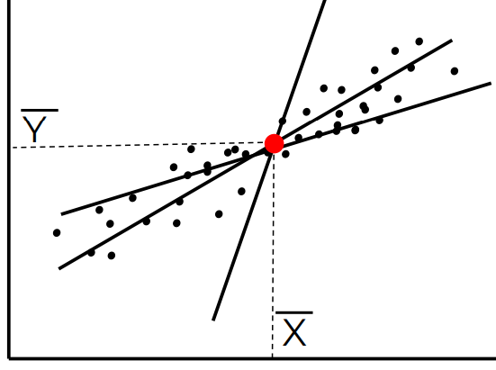
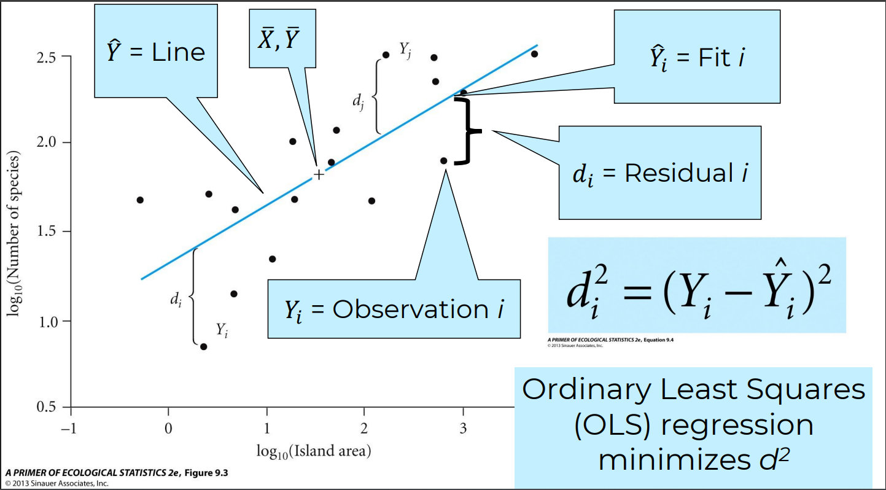
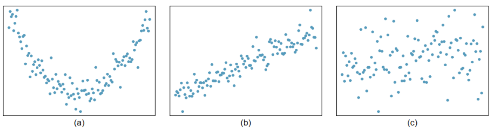
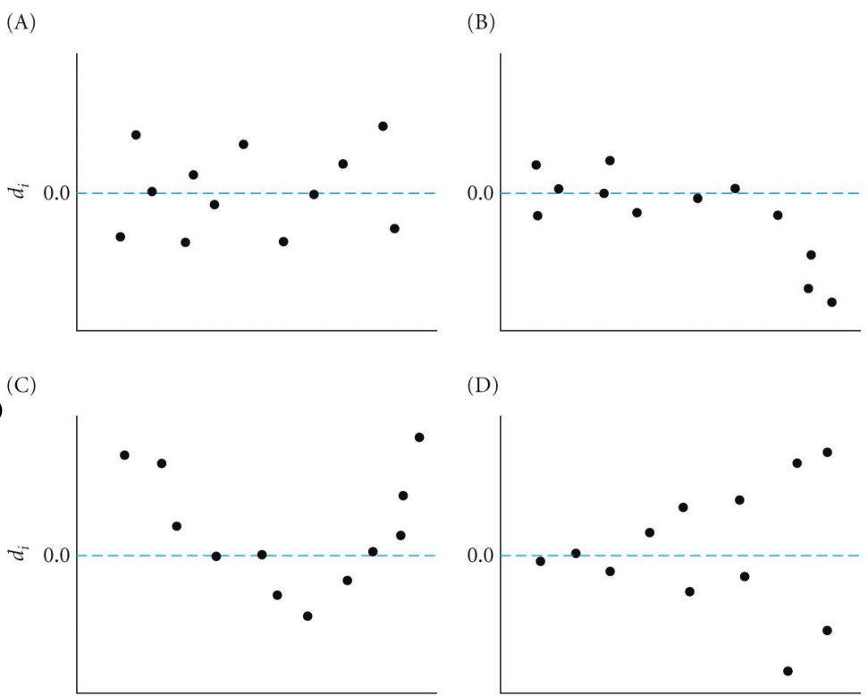
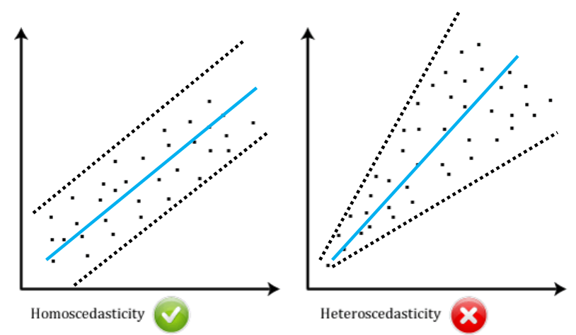
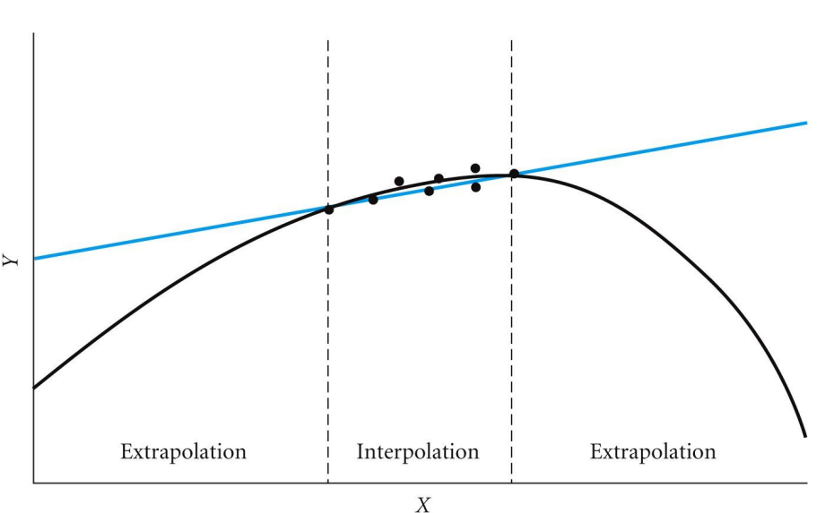

```{r}
#| label: setup
#| include: false

# libraries
library(tidyverse)

# data objects
data("trees")
```

# Overview

This lab will demonstrate how to perform a simple linear regression in R. This includes checking assumptions, fitting the linear model, interpreting and visualizing the results. 

# Setup

### Libraries

```{r}
#| eval: false
library(tidyverse)
```

### Data

We will use the `trees` data which comes with R. Load the data by running the following command:

```{r}
#| eval: false
data("trees")
```

`trees` contains data on the girth (DBH), height (in ft) and volume (cubic feet) of 31 black cherry trees. Run `?trees` to learn more about the data.  


# Lecture Outline

## Linear Regression  

-   Relationship between continuous variables  

-   This is a predictive relationship  

  -   i.e., with ANOVA, we could just say if the treatments were different  
  -   Not possible to predict what a *new* treatment would do  
  -   Linear regression does alow us to predict what a new treatment would do. 


-   Use scatter plots 

  -   `geom_point()`  
  
-     Fit a "best" line through the points

 


-   Determine "best" fit with Ordinary Least Squares (OLS)


 


-   Once we have a line, is it significant? or is there a relationship?  

-   is my slope = 0, or $\ne$ 0? 

We will be looking to see if girth (DBH) can be used as a predictor for tree height. But first, Let's look at the full data set. 

```{r}
names(trees)
dim(trees)
head(trees)
```

Notice that the all three variables are continuous ( class = `<dbl>`) and this suggests that we will be performing a linear regression. 

## Plot data

Let's start by plotting all of the data. `Height` is going to be our response variable, and `Girth` will be our predictor variable.  

```{r}
ggplot(trees,
       aes(x = Girth,
           y = Height)) +
  geom_point() +
  theme_bw()
```

### Questions

1. Does it appear that there is a uniform distribution of x-values (Girth)?

2. Does this look like a linear relationship to you? Why or why not? 

#### Example of non-uniform x-values

```{r}
#| echo: false

y = trees$Height
x = c(8, 9, 10,
      8.5, 9.5, 10.5,
      8.25, 9.25, 10.15,
      8.3, 9.3, 10.3,
      8, 9, 10,
      8, 9, 10,
      8, 9, 10,
      8, 9, 10,
      11, 12, 13,
      10, 20, 19, 10)

plot(y~x)
```


### Add a line of best fit  

We can also add a linear regression line using the `geom_smooth()` argument in ggplot. The default for this argument is to use a non-linear smoother, but we will be setting it to be a linear smoother using the `method = "lm` argument. 

```{r}
ggplot(trees,
       aes(x = Girth,
           y = Height)) +
  geom_point() +
  geom_smooth(method = "lm") +
  theme_bw()
```
-   It's always a good idea to check and make sure the scatter plot looks like it is linear  




## Equation for a linear regression

For a simple linear regression with one continous predictor, we have the following equation: 


$$ \hat{y} = \beta_0 + \beta_1 * x_1 $$

Where $\beta_0$ is the intercept and $\beta_1$ is the regression coefficient.  

## Hypotheses for linear regression  

### Intercept  

$$ H0: \beta_0 = 0 $$
$$ H0: \beta_0 \ne 0 $$

We have seen this a number of times at this point. Often, we are not interested in the value of the intercept coefficient per se, but we have to pick a value to compare it with and 0 is as good as any. When you perform a linear regression you should always report your findings and relate it to the null hypothesis. But since we're not *usually* interested in this value you would avoid discussing it in detail. 

### Regression coefficient(s)  

$$ H0: \beta_1 = 0 $$
$$ H0: \beta_1 \ne 0 $$

For the regression coefficient, the plain word interpretation for the NULL hypothesis is that "there is no relationship between x and y". Or, in other words, the value of y does not depend on the value of x. 

Likewise, the alternative hypothesis is that there is a relationship between x and y, or that the value of y does depend on the value of x. 


## Check pre-analysis assumptions  

### Assumptions: Normality of residuals  
#### QQ-plot 

```{r}
ggplot(trees,
       aes(sample = Height)) +
  stat_qq()+
  stat_qq_line()
```

Most of the observations (points) fall close to the reference line, meaning that we have a normal distribution of residuals. 

# Fit the linear model   

Let's fit a linear model to the data. 

```{r}
tree_lm <- lm(Height ~ Girth, data = trees)
```

### Assumption: Equal variance of residuals  

Before we look at the results, let's check our post-model fit assumption with a fitted vs. residuals plot. 

```{r}
ggplot(tree_lm,
       aes(x = .fitted, y = .resid)) +
    geom_point(
      position = position_jitter(
        width = 0.1,
        height = 0)) +
    geom_hline(yintercept = 0) +
  theme_bw()
```

In this plot, the absolute magnitude of the maximum and minimum y-values are approximately the same (~ -10, ~ 10), although there is one point below the -10 region. There may be slightly less variation on the right side (points are closer to the line).  

#### Examples of unequal variance  

-    Look for patterns L to R and Top to Bottom



## Equal variance around the regression line  

-   Check that the spread of the points around the line of best fit is equal  



# ANOVA table  

To assess the overall signifigance of our predictor variable (`Girth`) we can use the `anova()` function to print out an ANOVA tbale.  

```{r}
anova(tree_lm)
```

We have a row for the predictor variable as well as the residuals (unexplained variation). 

We interpret the F-value and p-value for our predictor variable in a similar way as before. 

**NOTE** The ANOVA table above directly answers the null hypothesis for our regression coefficient ($\beta_1$) that we stated above. The ANOVA table **DOES NOT** have any information about our intercept coefficient ($\beta_0$). Since we are often not interested in the intercept, the ANOVA table is usually appropriate for answering our main question about the relationship between x and y. 

## ANOVA Interpretation  

Remember that the hypothesis for the regression coefficient is that it is equal to zero (no relationship between x and y) or that it is not equal to 0 (there is a relationship between x and y). Therefore, our interpretation would look something like this:

> Based on our data, we can reject the null hypothesis and conclude that the value of y (Height) does depend on the value of x (Girth) in black cherry trees  ($F_{1, 29}= 10.7, p = 0.003$)


## `lm()` summary  

```{r}
summary(tree_lm)
```
### Interpretation  

We reject the null hypothesis for our intercept and conclude that it is not equal to 0 (estimate = 62, SE = 4.38, t-value = 14.152, p < 0.001)

We reject the null hypothesis for our regression coefficient (Girth) and conclude that it is not equal to 0 (estimate = 1.054, SE = 0.32, t-value = 3.272, p < 0.001)
 
### What do the coefficients "mean"?  

The intercept is the average estimated height of cherry trees when the girth is equal to 0. 

The regression coefficient means that for every 1-unit increase in girth, the height of the cherry tree increases by 1.05 feet on average. 

### Adjusted R^2^  

The adjusted R^2^ value for this model is 0.2445. This means that approximately 24% of the variation in height can be explained by the measured girth. Or, more generally this model explains ~24% of the variation in our data. 

### Full equation for the linear model  

$$ \text{Height} = 62.03 + 1.05 * \text{Girth} $$

#### Estimate values from equation  

Let's say you measure the girth of a new cherry tree and it is 19.75 inches. What would you predict the height to be? 

```{r}
62.03 + 1.05 * 19.75
```

Now, let's say that you measure the height of a cherry tree as 76 feet. What do you estimate the Girth will be?

First, re-arrange the equation to have Girth be isolated on one side of the = sign:

$$\frac{(\text{Height} - 62.03)} {1.05} = \text{Girth} $$

```{r}
(76 - 62.03) / 1.05
```


#### Estimate values with `predict()`  

-   We can also estimate values with the `predict()` function

-   Above, we estimated the height from a dbh of 19.75

-   let's do it again with `predict()`  

```{r}
predict(tree_lm, newdata = list(Girth = 19.75))
```

#### Fit vs. prediction  

-   The value that is returned by default is the "fitted" value (i.e., the value on the line in a regression)  

-    We can also account for uncertainty by modifying our `predict()` call

```{r}
predict(tree_lm,
        newdata = list(Girth = 19.75),
        interval = "prediction")
```
-   Now we have a 95% Prediction interval  

-   In other words, if we measure the height of the tree with dbh = 19.75, we should not be surprised if the observed height is actually between 70.5 and 95.1 feet  


#### Plotting a prediction interval for the full data range  

-   We can add the prediction interval to our plot  

-   First, we need to set up our data  

```{r}
girth_v <- seq(min(trees$Girth),
               max(trees$Girth),
               length.out = 100)

height_prediction <- predict(
  tree_lm,
  newdata = list(Girth = girth_v),
  interval = "prediction"
)

predict_plot_data <- data.frame(
  Girth = girth_v,
  height_prediction
) |>
  rename(Height = fit)

ggplot(trees,
       aes(x = Girth, 
           y = Height)) +
  geom_point() +
  geom_smooth(method = "lm") +
  geom_ribbon(data = predict_plot_data,
              aes(ymin = lwr, 
                  ymax = upr),
              fill = "dodgerblue", 
              alpha = 0.5)
```

#### Interpolation Vs. Extrapolation  

-   Generally only want to predict for values within the range of observed x  

  -   This is called **Interpolation**  
  
-   It can be risky to predict values outside of the range of observed x  

  -   This is called **extrapolation** 
  
-   For example, suppose the "real" relationship was non-linear:




# Summary

-   Linear regression shows causation - relationship between *continuous* variables  

-   Allow us to make predictions for new observations  

-   Always check assumptions  

-   $\beta_1$ tells us how $y$ changes with an increase in $x$ of 1 unit  