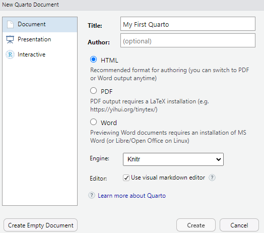

```{r}
#| label: setup
#| include: false

# libraries
library(tidyverse)

# data objects
rxp <- read.csv(here::here("data/RxP.csv"), stringsAsFactors = TRUE)
```

# Overview

This week, you will be introduced to Quarto. Quarto is a powerful editor which incorporates plain text and computer code together, and it can easily be rendered into different output formats (html, pdf, .doc, etc.). Quarto is especially useful for writing reports, summarizing/analyzing data, incorporating plots, etc. You will follow some self-guided reading and will submit a Quarto file (.qmd) as well as the rendered HTML document (.html) for Homework 10 (Due at the end of next week).

# Setup

### Install packages

-   Run the following code in your console before opening a quarto document

```{r}
#| eval: false
install.packages("here")
install.packages("rmarkdown")
```

## Open a Quarto document

-   New file dropdown icon in top right of Rstudio

-   New Quarto Document

-   Title: My First Quarto

-   Select HTML

-   Engine = knitr

-   Select "Use Visual Editor"

{fig-align="center"}

# Lecture Outline

## Get to know Quarto

There are three main sections

1.  An (optional) **YAML header** surrounded by `---`s.
2.  **Chunks** of R code surrounded by ```` ``` ````.
3.  Text mixed with simple text formatting like `# heading` and `_italics_`.

We will discuss these below, but first a note on the editors

-   You can use the "visual" editor or the "source" editor

    -   Visual is similar to what you have used in other programs like Word, Google Docs, etc.

        -   This is called "what you see is what you get" (\*wysiwyg\*) text editors

        -   when you highlight text and click the \`boldface\` icon, the text appears bold on your screen

        -   Likewise you can change the heading level, change the font to represent code, etc.

    -   Source is a simple text editor

        -   The biggest difference is that formatting occurs in the document itself rather than behind the scenes

        -   Switch to the source editor

        -   Notice the `##` for the headers, and the `*` around the word render to make it bold

    -   The visual editor is helpful, but it's important to also know the source editor

        -   The visual editor can be glitchy, and sometimes the only way to fix it is with the source editor

-   Try and make the bullet-point error in class as an example

    -   Start a bulleted list

    -   Add some subpoints in between

-   It get's "stuck" in bullet-mode

-   Go to source editor and delete bullets, add a new line to get out of bullet mode

-   Hanging bullets sometimes turn into code

-   delete the code chunk designation:

````         
```
some text in here
Delete the three ``` at the top and the bottom

```
````

## Render your Quarto

-   You can render your document into an .html document by clicking "render" at the top

-   I recommend rendering frequently to observe the changes you are making, and ensure that they are working properly

    -   If you have a lot of new text/code/content and it doesn't render, it can be difficult to figure out where the issue is

## Why use Quarto

R Markdown has many advantages compared to creating reports in Word or GoogleDocs. These advantages include:

1.  **Versatility** - Want to convert a Word document into pdf? That's not too hard. But pdf to Word? That's a pain (or at least it used to be). PDF to HTML? Maybe you know how to do that but I don't. With Quarto, we can change between these formats (or produce multiple outputs at once) with a few lines of code). You can even convert them into pretty nice slide shows.
2.  **Embed code in text** - After running an analysis, how do you get your results into Word? Type them by hand? Copy-and-paste? Both are a pain and error prone. Rerun your analysis using new data? Oops, now you have to copy and paste those new results and figures. With Quarto, we embed code directly into the text so results and figures get added to our reports automatically. That means no copying and pasting and updating reports as new results come in is pain free. I cannot emphasize enough how convenient this is. This will certainly save you time in the future.
3.  **Annotate your code** - Using the `#` is great for adding small annotations to your R scripts and you should definitely get in the habitat of doing that. But sometimes you need to add a lot of details to help other users (or your future self) make sense of complex code. For instance, in this class *interpreting* the results of statistical analyses can be detailed and complex. Writing this in Quarto will be much easier, and reading the html document will be easier for me to grade! Quarto allows you to create documents with as much text and formatting as you need, along with the code.
4.  **Version control** - Tired of saving "manuscript_v1.doc", "manuscript_v2.doc", "manuscript_final.doc", "manuscript_final_v2.doc"? Then version control is for you. We won't go into the specifics here but Quarto allows you to seamlessly use version control systems like git and Github to document changes to your reports.
5.  **Edit as text files** - Quarto files are most easily created and edited within RStudio but you don't have to do it that way. They can be opened and edited in base R and even using text editors. This means you can create and edit them on any platform (Windows, Mac, Linux) using free software that is already installed on the computer
6.  **Focus on text, not formatting** - Do you spend a lot of time tweaking the formatting of your Word document rather than writing? Quarto allows you to separate the writing process from the formatting process, which allows you to focus on the former without worrying about that later (in theory at least). Plus there are lots of templates you can use to ensure that the formatting is taken care without you having to do anything special!

## YAML Header

-   At the top of your `.qmd` file, you should see several lines of code in between three blue dashes

```         
---
title: "My First Quarto"
format: html
editor: visual
---
```

-   This is called the "YAML header"

-   it's where we can control a lot of the major formatting options for our documents.

    -   There's lots of formatting options you can include in the YAML header, most of which are beyond the scope of this course.

-   We will make some modifications below

-   We are going to modify the YAML header slightly as follows:

```         
format: 
  html:
    embed-resources: true
```

-   This code ensures that the rendered document can be read by other machines, even if they don't have all the libraries and software downloaded on their local machine.

### TOC

-   For this class we're going to stick with HTML output, but we will include table of contents by including the following code:

```         
toc: true
toc-depth: 3
number-sections: true
```

-   `toc-depth: 2` means that the table of contents will only show heading levels 1 to 3

-   Render your HTML

### Themes

-   There are many themes available, and you can see a list of them [here](https://quarto.org/docs/output-formats/html-themes.html)

-   We will include a light and dark theme with the following code:

`{theme:}   light: flatly   dark: darkly`

-   Now when we render, there will be an icon to switch between light and dark themes

### Changing output

-   to change the output to pdf, just switch `format: html` to `format: pdf`

    -   **note**, you may need to install a Latex distribution to knit to pdf. If you get an error message at this step

    -   Try running `install.packages("tinytex")`

    -   If this doesn't work, try clicking in your terminal (tabl in console pane) and type:

    -   `quarto install tinytex`

### Multiple outputs

-   We will not do this in class, but if you wanted to have multiple outputs, you would modify your YAML header as follows:

```         
format:    
  html:      
    embed-resources: true   
  pdf: default   
  docx:      
    toc: true     
    number-sections: true
```

-   You can add options underneath each format

-   For example, the html doc has the optional embed-resources, the pdf document follows the default options, and the docx has a numbered TOC.

## Text sections

-   The text section is where you can type text as in a word or similar document
-   Let's start by deleting all text in our Quarto to start fresh
    -   Be sure to keep the YAML header changes we just made above.

### Headers

-   Using headers is a natural way to break up a document or report into smaller sections.
-   In the visual editor, you can select the header level from the dropdown menu
    -   Show an example
-   For the course editor, You can include headers by putting one or more `#` signs in front of text.
-   One `#` is a main header, `##` is the secondary header, etc.

# Header 1

## Header 2

### Header 3

#### Header 4

### Paragraph and line breaks

When writing chunks of text in Quarto (e.g., a report or manuscript), you can create new paragraphs by leaving an empty line between each paragraph:

```         
This is one paragraph.

This is the next paragraph
```

### Font formats

#### **Bold**, *Italics*, sub- and superscripts

-   Select the appropriate option in the "Format' menu in the visual editor

-   For the source editor, use the following plain text formats

-   create **boldface** by surrounding text with two asterisks (`**bold**`)

-   Use single asterisks for *italics* (`*italics*`).

-   Enter ~~strikethrough~~ text with `~~strikethough~~`.

-   Subscripts: H~2~O (`H~2~O`) and

-   Superscripts: x^10^ (`x^10^`)

-   **NOTE** that the code for sub and superscripts in math equations is slightly different, see below.

#### `Code` font

-   You can change the font to indicate that you are talking about code

-   For example, if we want to talk about the mean function, we can chnage the font so it looks like code: `mean()`

-   Visual

    -   highlight the text and select the code "\</\>" option at the top

-   Source

    -   put \` around the text you want to display as code

-   Note that either way, this does not produce *functioning* code

    -   It just changes the display to let the reader know we are *talking* about code

-   We will insert functioning code below

## Lists

-   You can start lists by clicking the appropriate option in the "Format" menu

### Bulleted lists

-   Bulleted lists can be included by starting a line with a `-` followed by a `tab`

-   for sub-bullets, indent the line (press `tab` once) and start it with `-`

#### Numbered lists

-   Start a numbered list with the 1. followed by a `tab`

-   You can enter sub bullets as a number or a bullet

    -   Press `tab` at the beginning of the line, then enter the number you want or a `-`

1.  Here's a numbered point

    -   And a sub bullet point

#### Hyperlinks

-   Insert hyperlinks by highlighting the text you want displayed and opening the "Insert" menu and selecting "link".

    -   You can then copy the url in the pop-up menu

    -   Here's a link to a [Quarto tutorial](https://quarto.org/docs/get-started/hello/rstudio.html)

-   For the source editor, put the text in `(text)` and the url in `[url]`

    -   There is no space between the `)[` i.e.,

        -   (link)\[url\]

## Math Equations

You can include equations either inline ($e = mc^2$) or as a stand-alone block:

$$
e = mc^2
$$

-   Inline equations are added by putting a single dollar sign `$` on either side of the equation (`$e=mc^2$`).

-   Equation blocks are create by starting and ending a new line with double dollar signs

```         
$$
e=mc^2
$$
```

### Greek letters

-   Statistical models include a lot of Greek letters ($\alpha, \beta, \gamma$, etc.).

-   You can add Greek letters to an equation by typing a backslash `\` followed by the name of the letter `\alpha`.

-   Uppercase and lower case letters are possible by capitalizing the name ($\Delta$ = `$\Delta$`) or not ($\delta$ = `$\delta$`).

-   You can also add Greek letters directly inline with text as so: `here is my line of text with the letter $\alpha$`

### Fractions

-   For simple fractions, such as $SEM = \sigma / \sqrt(n)$ you can just type a `/`. For example

```         
$SEM = \sigma / \sqrt(n)$.
```

-   For more complex fractions, you need to distinguish it using `\frac { top }{ bottom }`.

-   For instance, to write the equation for Bayes theorem:

$$ P(A|B) = \frac{ P(B|A)\times P(A) } { P(B) }$$

-   you would type the following: `$$ P(A|B) = \frac{ P(B|A)\times P(A) }{ P(B) }$$`

## Equation Subscripts and superscripts

-   You can add superscripts using the `^` ($\pi r^2$=`$\pi r^2$`) symbol and subscripts using an underscore `_` ($N_t$ = `$N_t$`).

    -   Note that only one `^` or `_` is needed at the beginning.

    -   Look again at adding sub- and superscripts to normal text above to see the differences.

-   If the superscript or subscript in an equation includes more than one character, put the entire script within curly brackets `{}`

    -   $N_t-1 \neq N_{t-1}$ is

    -   `$N_t-1 \neq N_{t-1}$`

## Add functioning Code to Quarto

### Code chunks

-   Code chunks are useful to display larger sections of code to the reader

-   Code chunks look like this

```{r}
#| eval: true
library(tidyverse)
data("PlantGrowth")
as_tibble(PlantGrowth)
```

-   You can see the code that was entered, as well as the display below it

-   Insert code chunks by pressing "/" and then selecting "R Code Chunk"

    -   You can also insert by pressing `ctrl` + `alt` + `i`

    -   Or by typing three \` and {r} and pressing enter

-   We only use R in this class, but note that you can insert functioning code chunks from other languages

    -   e.g., Python, Julia, stan, html, etc.

### Code chunk options

-   You can decide if the code you include in the chunk is displayed or not, as well as if it is actually run or not

Options available for customizing output include:

| Option    | Description                                                                                                                                                                                       |
|-------------|-----------------------------------------------------------|
| `eval`    | Evaluate the code chunk (if `false`, just echos the code into the output).                                                                                                                        |
| `echo`    | Include the source code in output                                                                                                                                                                 |
| `output`  | Include the results of executing the code in the output (`true`, `false`, or `asis` to indicate that the output is raw markdown and should not have any of Quarto's standard enclosing markdown). |
| `warning` | Include warnings in the output.                                                                                                                                                                   |
| `error`   | Include errors in the output (note that this implies that errors executing code will not halt processing of the document).                                                                        |
| `include` | Catch all for preventing any output (code or results) from being included (e.g. `include: false` suppresses all output from the code block).                                                      |

### Special consideration for reading in data

-   We need to do something special to read in data which is stored in a sub folder

-   Recall that so far this semester, we have done the following:

```{r}
#| eval: false
library(tidyverse)
finch <- read.csv("data/galapago-finches.csv")

```

-   If we try and run this in a code chunk, we get an error that says something like:

```         
Warning: cannot open file 'data/galapago-finches.csv': No such file or directoryError in file(file, "rt") : cannot open the connection
```

-   To get around this, we use the `here()` function from the `here` package

    -   We only want to use this one function, so instead of loading the library, we can call it useing this notation:

        -   `package_name::function_name()`

-   So to read in data from our `data/` folder, we run the following:

```{r}
library(tidyverse)
finch <- read.csv(here::here("data/galapago-finches.csv"))
```

-   Now we can type some text

-   And then run code on the `finch` object in subsequent code chunks

```{r}
as_tibble(finch)
ggplot(finch,
       aes(x = species,
           y = bdepth,
           color = species)) +
  geom_boxplot() +
  facet_wrap(~year)
```

# Summary

-   Quarto is a useful engine for writing reports integrating text and computer code

-   It produces documents which are easily shared, and do not require the reader to know any code or have any special software downloaded

-   Homework assignments for the rest of the semester will be submitted as rendered html documents, which you will write in Quarto.
